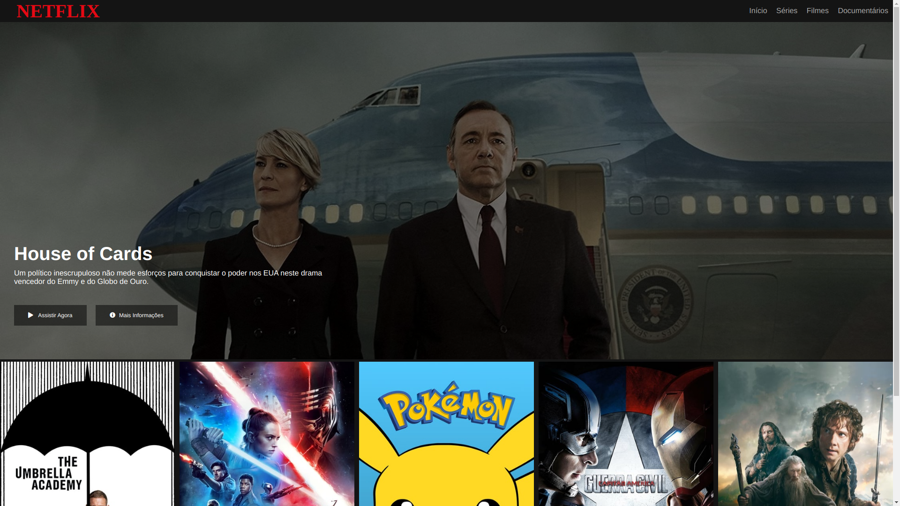

    <h1 align="center">Netflix Clone</h1>
    
    

    
Pojeto em constução🛠👨‍💻
 

 
Clone da interface da Netflix criado no bootcamp HTML Web Developer da <a href="https://web.dio.me/home">DIO.me</a> 
<a href="https://wiriswernek.github.io/Netflix-clone/">Teste Clicando Aqui</a>  

Tecnologias utilizadas:

 
 
 
 
 
