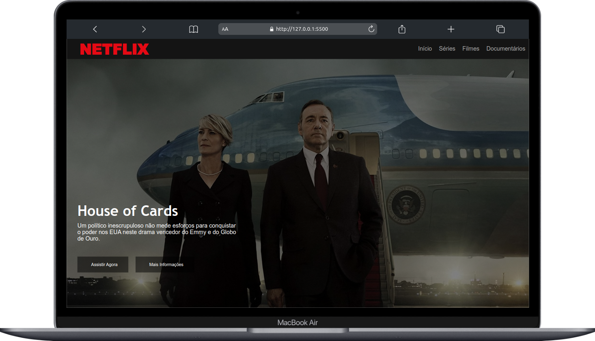
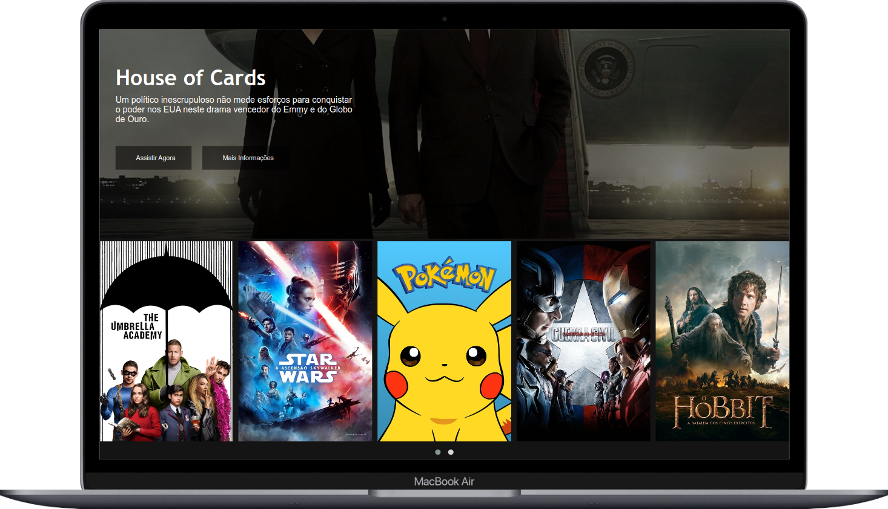
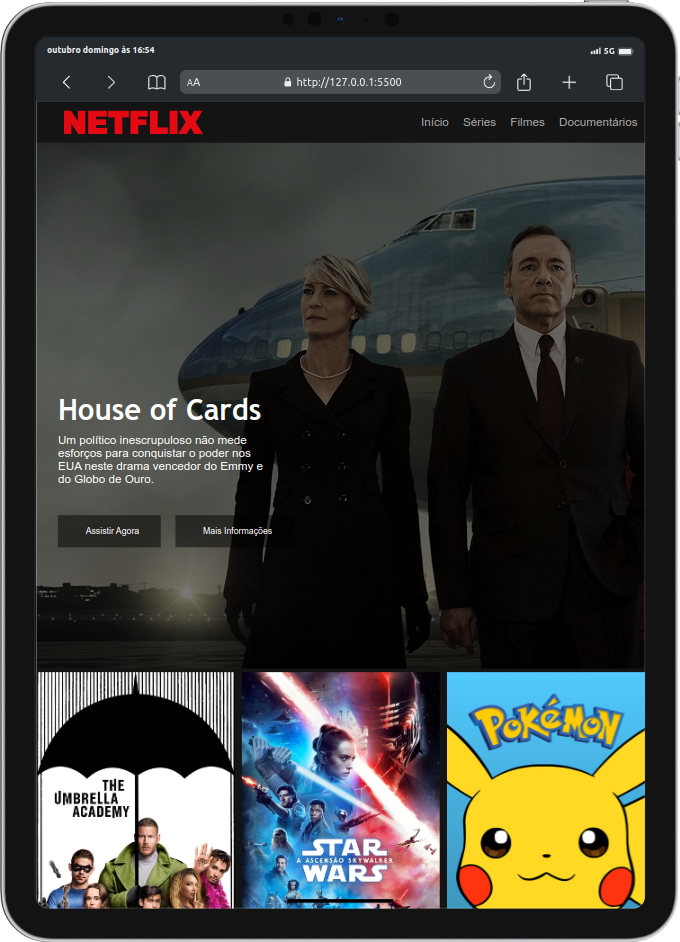

# Netflix Clone 

## Sobre
Clone da interface da Netflix criado no bootcamp HTML Web Developer da <a href="https://web.dio.me/home">DIO.me</a> 

Segue abaixo uma prévia da aplicação.

<h2 align="center">Preview Desktop</h2>

	
	

<h2 align="center" style="margin-top: 4rem;">Preview Tablet</h2>

	

## Como executar esta aplicação?

Para rodar a aplicação voce deve:
- Primeiro clonar este repositório
- Navegar para a pasta `Netflix-clone`
- Pode utilizar a extensão Live Server do Visual Studio Code para abrir o projeto ou utilizar o seu navegador para abrir o arquivo `index.html` 

Tecnologias utilizadas:
-  
-  
-  
-  
-  
